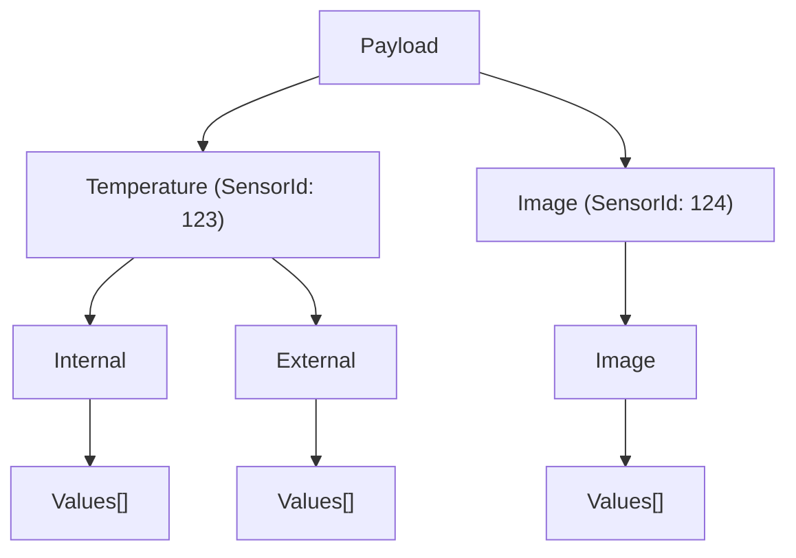

# Appendix 2: Edge Data Access and MQTT Broker Integration

The **MYWAI Edge** system is designed to collect various types of data from multiple sources. It buffers this data, executes AI algorithms locally on the edge device, and periodically transmits relevant results to the MYWAI Platform.

In certain scenarios, it is also necessary to present the collected data directly on the Edge side. This is typically achieved using a dedicated toolkit deployed on the Edge device, which includes a user interface for displaying data to local operators.

## Using the Edge MQTT broker

A straightforward way to integrate with the MYWAI Edge is to connect the toolkit to the **local MQTT broker** running within the Edge environment. This broker acts as a central hub for data flowing through the system:

* All data from the **adapters** (data collection interfaces)
* All outgoing messages sent to the **MYWAI Platform**

All of this data is routed through the MQTT broker.

The broker used in MYWAI Edge is based on **Eclipse Mosquitto**. By default, Mosquitto is only accessible from within the Edge container and is **not exposed externally**.

## Exposing Mosquitto for External Access

If you need to connect an external client or dashboard to the Edge MQTT broker, you must:

### **Expose the MQTT Port (default 1883)**:

Modify the container to expose port `1883` (or `8883` if using TLS).

`docker run -p 1883:1883 mywai-edge-container`

### **Configure Mosquitto for External Connections**

****TODO****

## Message payload example

Here an example of a message sent periodically by the Edge to the Platform with some data coming from:

* A **Temperature** sensor that provides 2 value fields: internal and external
* One **Image** sensor that provide image files.

This message has the topic **"Sensors/NewWindow"** and the structure of the payload can be summarized as following:



And here below the JSON payload:

<Warning>
The following example is DRAFT and need to be reviewed.
</Warning>

```json
{
  "AlgorithmResult": null,
  "EventDate": "2025-05-06T14:30:00Z",
  "Payload": [
    {
      "FactId": "e4eaaaf2-d142-11e1-b3e4-080027620cdd",
      "SensorId": 123,
      "FieldId": 0,
      "SensorMeasure": {
        "Id": 1,
        "SensorId": 123,
        "FieldId": null,
        "Type": 0,
        "Measure": {
          "Id": 101,
          "Name": "Temperature",
          "Deleted": false,
          "Configuration": [
            {
              "Id": 2001,
              "Name": "Internal",
              "Type": 3,
              "TypeName": "Float"
            },
            {
              "Id": 2002,
              "Name": "External",
              "Type": 3,
              "TypeName": "Float"
            }
          ]
        },
        "MilliSecondsFrequency": 5000
      },
      "Items": [
        {
          "Serie": "Temperature_Internal",
          "MeasureConfigurationId": 2001,
          "SensorMeasureId": 1,
          "Values": [
            {
              "DetectionTime": 1715004000000,
              "StringValue": null,
              "Value": 21.1
            },
            {
              "DetectionTime": 1715004300000,
              "StringValue": null,
              "Value": 21.3
            },
            {
              "DetectionTime": 1715004600000,
              "StringValue": null,
              "Value": 21.0
            }
          ]
        },
        {
          "Serie": "Temperature_External",
          "MeasureConfigurationId": 2002,
          "SensorMeasureId": 1,
          "Values": [
            {
              "DetectionTime": 1715004000000,
              "StringValue": null,
              "Value": 23.4
            },
            {
              "DetectionTime": 1715004300000,
              "StringValue": null,
              "Value": 23.7
            },
            {
              "DetectionTime": 1715004600000,
              "StringValue": null,
              "Value": 23.5
            }
          ]
        }
      ],
      "RangeLength": 5,
      "DeviceType": "Sensor"
    },
    {
      "FactId": "f9a139ec-d1d0-4ed6-bd11-4e61a8c55eab",
      "SensorId": 124,
      "FieldId": 0,
      "SensorMeasure": {
        "Id": 2,
        "SensorId": 124,
        "FieldId": null,
        "Type": 5,
        "Measure": {
          "Id": 102,
          "Name": "Image",
          "Deleted": false,
          "Configuration": [
            {
              "Id": 3001,
              "Name": "Image",
              "Type": 5,
              "TypeName": "Image"
            }
          ]
        },
        "MilliSecondsFrequency": 10000
      },
      "Items": [
        {
          "Serie": "Image",
          "MeasureConfigurationId": 3001,
          "SensorMeasureId": 2,
          "Values": [
            {
              "DetectionTime": 1715004000000,
              "StringValue": null,
              "Value": null,
              "BlobMetadata": {
                "Uri": "https://example.com/image_blob1.jpg",
                "FullPath": "",
                "ThumbFullPath": "",
                "Duration": null,
                "TempoStart": 1715004000000,
                "TempoEnd": 1715004000000
              }
            },
            {
              "DetectionTime": 1715004300000,
              "StringValue": null,
              "Value": null,
              "BlobMetadata": {
                "Uri": "https://example.com/image_blob2.jpg",
                "FullPath": "",
                "ThumbFullPath": "",
                "Duration": null,
                "TempoStart": 1715004300000,
                "TempoEnd": 1715004300000
              }
            },
            {
              "DetectionTime": 1715004600000,
              "StringValue": null,
              "Value": null,
              "BlobMetadata": {
                "Uri": "https://example.com/image_blob3.jpg",
                "FullPath": "",
                "ThumbFullPath": "",
                "Duration": null,
                "TempoStart": 1715004600000,
                "TempoEnd": 1715004600000
              }
            }
          ]
        }
      ],
      "RangeLength": 3,
      "DeviceType": "Sensor"
    }
  ]
}

```
