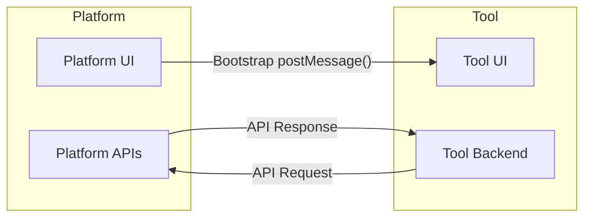

## Technical requirements

Here the basic requirements for a Marketplace tool:

* Define the Tool metadata.
* Expose the User Interface via an HTTPS endpoint.
* Manage the bootstrap message that is provided by the MYWAI Platform with the entry point URL launch.
* Consume MYW.AI Platform APIs to integrate with the Platform data:
  * Via direct REST API calls
  * Using Python low-level wrapper
  * Using Python high-level wrapper
* \[Optional/Suggested] Embed you service into a Docker image for an easier deployment.
* Publish the tool into the Platform Marketplace.



## Tool metadata

These are the tool metadata to be provided to the Platform:

* **uniqueId**: the tool unique identifier (alphanumeric, allowed character set: \[A-Za-z0-9\_-]).
* **name** (string)
* **description** (multi-line string)
* **version** (string)
* **webUrl** (URL): the URL opened inside the platform \<iframe>.
* **imageUrl** (URL): the URL of the tool description image, to be shown in the Marketplace tools page.
* **iconUrl** (URL): the URL of the icon image.
* **dataTypes** (image | video | audio | timeseries | event): an array the type of data the tool is able to manage.

<Warning>
The webUrl must be an HTTPS endpoint.\
HTTP is supported only for http://localhost or http://127.0.0.1 endpoints. If you need to use HTTP with other urls, please check this [section](/marketplace-tools/tool-development-guidelines#embedding-http-tools-in-an-https-platform).
</Warning>

## Publish your Tool into the Platform Marketplace

Based on the existing setup, adding a new tool to the Platform Marketplace requires modifying the _`data/config/tools.json`_ file located in the platform's blob storage. Future versions of the platform might offer more streamlined methods for integrating new tools into the Marketplace.

Here an example of the JSON configuration for a tool, to be added in the _tools.json_ file:

```json
{
  "uniqueId": "MAMBO",
  "name": "MAMBO",
  "description": "MAMBO",
  "version": "0.1",
  "webUrl": "http://localhost:8506/",
  "imageUrl": "https://4kwallpapers.com/images/wallpapers/harmonyos-3d-render-5120x2880-12645.png",
  "iconUrl": "",
  "dataTypes": [
    "image"
  ]
}
```

## User interface guidelines

The Tool user interface is hosted into an \<iframe> of the MYWAI Platform.

In the design of the UI of your Tool take in consideration the following notes:

* Consider that your entire Tool UI will be hosted inside the MYWAI Platform Marketplace \<iframe>, so the platform header bar and left menu remains visible (even the left menu can be collapsed).
* Take in consideration that the size of the \<iframe> may change if the user expands or collapses the menu or resizes the browser window, so manage your content so that respond properly to the size change.
* Use whenever possible the same UI style of the platform (text font and sizes, style of dropdown etc.). If you plan to use Vuetify2, consider to use the same platform CSS classes.
* Support both dark and light theme.

## Bootstrap message

After your **webUrl** is opened into the \<iframe>, your web page is expected to send a message (via JS [postMessage()](https://developer.mozilla.org/en-US/docs/Web/API/Window/postMessage) function) to inform the hosting platform that has been loaded.

```javascript
try {
  setTimeout(() => {
    try { window.parent?.postMessage('acknowledgment', '*'); } catch {}
  }, 300);
} catch {}
```

After that, a message will be sent from the platform to your web page with the following payload:

```json
{
    "message": "mywai-tool-init",
    "user": {
        "id": "12345"
        "name": "Jonh",
        "surname": "Doe",
        "email": "john.doe@acme.com",
        "auth-token": "the-authentication-token"
    },
    "config": {
        "api-endpoint": "https://myplatform.myw.ai/api",
        "theme": "light"
   } 
}
```

## Consume the platform Web APIs

### Direct REST API calls

When making the HTTP calls to the Platform APIs, the requests must include an `Authorization` header with the bearer token. Here’s a generic example using `fetch` in JavaScript:

```javascript
// The API endpoint as provided by the api-endpoint param of the bootstrap message
const apiEndpoint = "";

// The authentication token as provided bythe auth-token param the bootstrap message
const authToken= "";

// Options for the fetch request
const options = {
  method: 'GET', // Use 'GET' for fetching data. Change to 'POST', 'PUT', etc., for other types of requests.
  headers: {
    'Authorization': `Bearer ${authToken}`, // Set the Authorization header with the Bearer token
    'Content-Type': 'application/json' // Set the content type of the request
  },
  // Uncomment the below line for POST requests and replace the body content as necessary
  // body: JSON.stringify({ key: "value" }) // Your data here for POST/PUT requests
};

// Make the API call with the fetch API
fetch(apiEndpoint, options)
  .then(response => {
    // Check if the response is successful (status in the range 200-299)
    if (!response.ok) {
      throw new Error('Network response was not ok: ' + response.statusText);
    }
    return response.json(); // Parse the response body as JSON
  })
  .then(data => {
    console.log(data); // Handle the data from the response
  })
  .catch(error => {
    console.error('Error:', error); // Handle any errors that occurred during the fetch
  });

// Note: For POST requests, ensure to set `options.method` to 'POST' and provide the `options.body` with your data.

```

### Python High Level APIs Wrapper

In addition to direct calls to the Web APIs, a Python package provided by MyWai can be used to manage all communication with the platform. This package, called `mywai_python_integration_kit`, allows both interaction with the APIs and communication with Mywai's databases. For detailed information on how to work specifically with the APIs within this package, please refer to the dedicated section [here](/marketplace-tools/python-high-level-apis-wrapper).

### Refresh the authentication token

<mark style="background-color:yellow;">TODO</mark>

## **Embedding HTTP Tools in an HTTPS Platform**

Tools exposed over HTTP (and not HTTPS) can only be embedded inside a platform if they are accessed via `http://localhost` or `http://127.0.0.1`. This is due to browser security policies, specifically Mixed Content Blocking, which prevents embedding an HTTP URL (the tool) into an HTTPS page (the platform). As a result, the tool will not function unless accessed locally.

To bypass this restriction and securely expose your HTTP tool for embedding, you can use a tunneling service like **NGROK** to expose your service through a secure HTTPS endpoint. Follow these steps:

1. **Install NGROK**\
   Download and install NGROK on the machine that hosts the tool’s HTTP service:\
   [https://download.ngrok.com/](https://download.ngrok.com/)
2.  **Log into NGROK**\
    Go to the following url [https://dashboard.ngrok.com/get-started/setup/linux](https://dashboard.ngrok.com/get-started/setup/linux) and copy the code that contains the following private information and paste it into your machine's shell:

    ```bash
    ngrok config add-authtoken <your-personal-token>
    ```
3.  **Run NGROK**\
    Start NGROK by specifying the protocol and the port used by your tool:

    ```bash
    ngrok http <port>
    ```

    Replace `<port>` with the port number your tool is listening on.
4. **Retrieve the HTTPS Endpoint**\
   After running NGROK, it will generate a public HTTPS URL. Copy this URL from the NGROK output.
5. **Update Your Configuration**\
   Use the generated NGROK URL to update your platform configuration file (e.g., `tools.json`) or wherever the tool’s endpoint is defined.

<Warning>
NGROK generates a new HTTPS URL each time it starts. If your setup requires persistent URLs, consider using a paid NGROK plan with custom domains or explore other tools that support static endpoint configurations.
</Warning>

<Warning>
Each Linux user has their own unique NGROK authentication token. This token is required to authenticate and establish a secure connection with the NGROK service. To ensure proper functionality, the NGROK token must be individually configured for each user on the system. This means that each user should add their specific token to their environment or configuration settings to enable access and maintain separation between user sessions.
</Warning>

## Integration troubleshooting

### The Tool web URL cannot be accessed from external machines

Ensure your server is configured to accept requested from the external.\
Here some configuration examples:

#### Streamlit

File `.streamlit/config.toml`:

```
[browser]
serverAddress = "0.0.0.0"
...
```

#### Vue.js

File `vue.config.js`:

```
...
devServer: {
    host: '0.0.0.0',
    ...
```

### Browser shows security errors

If the browser does not open the tool properly due to security errors, try to disable CORS and XSRF protections.

#### Streamlit

File `.streamlit/config.toml`:

```
[server]
enableCORS = false
enableXsrfProtection = false
```
